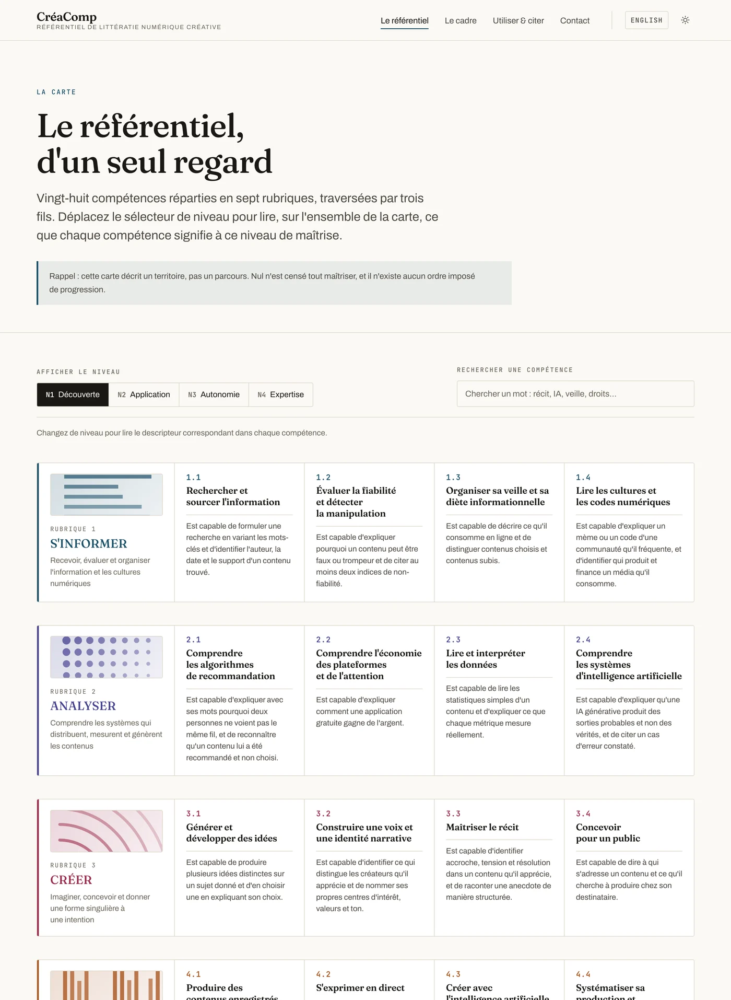

<div align="center">

# CréaComp

**Le référentiel de compétences pour l'ère des créateurs**

Sept rubriques, 28 compétences, 124 descripteurs, quatre niveaux de maîtrise.
Bilingue français / anglais, librement réutilisable.

[**creacomp.org**](https://creacomp.org) · [Le référentiel](https://creacomp.org/referentiel/) · [Le cadre](https://creacomp.org/cadre/) · [English](https://creacomp.org/en/)

[](https://github.com/Megamax76/creacomp-site/actions/workflows/deploy.yml)
[](https://creativecommons.org/licenses/by-sa/4.0/deed.fr)
[](LICENSE-CODE)
[](https://astro.build)


</div>

---

## Sommaire

- [De quoi s'agit-il](#de-quoi-sagit-il)
- [La littératie numérique créative](#la-littératie-numérique-créative) — le concept central
- [D'où vient le nom](#doù-vient-le-nom)
- [Le référentiel en un coup d'œil](#le-référentiel-en-un-coup-dœil)
- [Utiliser le référentiel](#utiliser-le-référentiel-sans-toucher-au-code)
- [Faire tourner le site](#faire-tourner-le-site)
- [Comment le site est fait](#comment-le-site-est-fait)
- [Modifier le contenu](#modifier-le-contenu)
- [Mise en ligne](#mise-en-ligne)
- [Sécurité](#sécurité)
- [Contribuer](#contribuer)
- [Citer CréaComp](#citer-créacomp)
- [Licences](#licences)
- [English summary](#english-summary)

---

## De quoi s'agit-il

**CréaComp** — contraction de *Creative Competence* — **est un référentiel de
compétences** : une description structurée de ce qu'il faut savoir faire pour
créer, diffuser et vivre de contenus numériques. Son objet est un concept unique,
la **littératie numérique créative**, qu'il a pour seule ambition de rendre
enseignable et évaluable.

Il couvre ce que les référentiels existants traitent mal ou pas du tout : la
lecture critique d'un flux algorithmique, la construction d'une voix, le travail
avec l'IA génératrice, l'économie de l'attention, la soutenabilité d'une pratique
créative.

Il s'adresse à qui doit **former, évaluer ou se situer** : enseignants et
formateurs qui adossent une progression à un cadre explicite, organismes qui
construisent une certification, créateurs qui veulent savoir ce qu'il leur
reste à apprendre, chercheurs qui étudient ces compétences.

Ce dépôt contient **deux choses** : le référentiel lui-même, sous forme de
données structurées réutilisables, et le site qui le publie.

| | |
|---|---|
| **Version** | CréaComp 1.0 — édition 2026 |
| **Auteur** | Maxime Hébert |
| **Langues** | français (source), anglais (traduction maintenue à la main) |
| **Objet** | la littératie numérique créative — [voir la définition](#la-littératie-numérique-créative) |
| **Filiation** | la famille européenne des référentiels *Comp — DigComp, EntreComp — sans affiliation institutionnelle |
| **Contenu** | CC BY-SA 4.0 — réutilisation, traduction et adaptation libres |
| **Statut** | publié ; le protocole de validation empirique est ouvert aux contributions |

> [!NOTE]
> Le référentiel décrit **un territoire, pas un parcours**. Nul n'est censé
> tout maîtriser, et il n'existe aucun ordre imposé de progression.

## La littératie numérique créative

Tout, dans CréaComp, tourne autour d'un seul concept. Les sept rubriques n'en
sont que la décomposition opératoire.

> **La littératie numérique créative est la capacité d'une personne à naviguer
> au cœur du web créatif et à y devenir actrice de la création plutôt que
> destinataire de celle des autres.**
>
> Elle désigne l'ensemble articulé de savoirs, de savoir-faire et de
> dispositions qui permet de **recevoir de façon critique** ce que des systèmes
> algorithmiques distribuent, de **comprendre** les logiques techniques et
> économiques qui gouvernent cette distribution, de **concevoir et fabriquer**
> des contenus porteurs d'une intention propre, de les **adresser** à un public
> réel, et de **soutenir** cette pratique dans le temps — matériellement,
> juridiquement et humainement.

### Pourquoi « littératie », et non « compétence »

Le terme est emprunté aux *literacy studies*, où une littératie ne désigne pas
un inventaire de gestes techniques mais un **ensemble de pratiques socialement
situées** : savoir lire et écrire n'est pas savoir tenir un stylo. Ce choix de
mot engage trois choses qu'un référentiel de compétences logicielles ne dit pas.

- **Elle est indissociable de ses contextes.** La même capacité ne s'exerce pas
  de la même façon selon la plateforme, le public, la communauté et l'économie
  dans lesquels on écrit. Un descripteur qui serait vrai hors de tout contexte
  serait vide.
- **Elle est graduelle, pas binaire.** On n'est pas « alphabétisé » ou non : on
  lit et on écrit plus ou moins finement. D'où quatre niveaux de maîtrise, et non
  une liste d'acquis à cocher.
- **Elle est critique autant que productive.** Lire suppose de reconnaître ce
  qu'on cherche à nous faire faire ; écrire suppose de répondre de ce qu'on
  fait faire aux autres.

### Lire et écrire le web créatif

La littératie numérique créative se tient donc sur **deux jambes**, et l'ordre
des rubriques suit ce partage :

| | Ce que cela veut dire concrètement | Rubriques |
|---|---|---|
| **Lire** | Décoder un flux recommandé, distinguer un contenu choisi d'un contenu subi, reconnaître un format, un code de communauté, un modèle de revenus, une manipulation ; comprendre qu'une IA génératrice produit des sorties probables et non des vérités | 1 · 2 |
| **Écrire** | Faire naître une intention et lui donner une forme singulière, construire une voix reconnaissable, tenir une cadence, s'adresser à quelqu'un, collaborer, faire vivre une activité de sa pratique | 3 → 7 |

Les trois fils transversaux — **Discerner**, **Durer**, **Se réinventer** — ne
se rangent dans aucune des deux colonnes parce qu'ils conditionnent les deux :
on ne lit pas honnêtement si l'on n'écrit pas loyalement, et l'on ne fait ni
l'un ni l'autre longtemps si l'on s'épuise.

### Ce que le concept n'est pas

Une définition ne vaut que par ce qu'elle exclut. La littératie créative
numérique n'est donc :

- **ni la maîtrise d'outils** — savoir monter une vidéo dans un logiciel donné
  est une habileté technique, remplaçable et périssable, pas une littératie ;
- **ni la promotion de soi** — se rendre visible est un effet possible de la
  pratique, pas son objet ; le référentiel décrit une capacité à créer, pas une
  stratégie de notoriété ;
- **ni l'esprit d'entreprise seul** — entreprendre et rentabiliser en sont deux
  rubriques sur sept, pas la finalité ;
- **ni la créativité en général** — l'inventivité est une disposition
  psychologique largement étudiée ailleurs ; ce qui est décrit ici est ce qui
  permet à une intention créative de **circuler** dans des environnements
  numériques, ce qui est autre chose.

L'enjeu, en un mot, est une **asymétrie** : beaucoup reçoivent, peu produisent,
et moins encore comprennent ce qui décide de ce qui leur parvient. Nommer une
littératie, c'est poser que cet écart s'apprend et donc s'enseigne.

## D'où vient le nom

**CréaComp** contracte *Creative Competence*, sur le modèle des référentiels de
compétences publiés par le **Centre commun de recherche** de la Commission
européenne (*Joint Research Centre*), qui ont fait de ce suffixe une
convention :

| Référentiel | Objet | Origine |
|---|---|---|
| **DigComp** | la compétence numérique du citoyen | JRC, première version en 2013, aujourd'hui en version 3.0 |
| **EntreComp** | la compétence entrepreneuriale | JRC et DG Emploi, juin 2016 — 3 domaines, 15 compétences |
| **CréaComp** | la littératie numérique créative | travail indépendant, 2026 |

Le nom situe donc une **parenté d'intention** : décrire une capacité en termes
observables et graduels, pour qu'elle devienne enseignable et évaluable.

CréaComp se place précisément là où ces deux cadres **ne se recouvrent pas**.
DigComp décrit le citoyen numérique — s'informer, communiquer, se protéger — mais
ne dit presque rien du fait de produire une œuvre et d'en vivre. EntreComp
décrit l'entrepreneur — repérer une occasion, mobiliser des ressources, agir —
sans rien devoir aux logiques propres des plateformes et de l'attention.
L'espace laissé vide entre les deux est exactement celui du créateur numérique :
c'est celui-là que CréaComp cartographie.

> [!IMPORTANT]
> **CréaComp n'est ni un produit ni une publication de l'Union européenne.**
> Le nom suit une convention et revendique une filiation méthodologique ; il
> n'implique aucune affiliation, validation ni approbation institutionnelle.
> DigComp et EntreComp sont mentionnés comme travaux voisins, dont les niveaux
> de maîtrise ont servi de repère à la construction des quatre niveaux d'ici.

## Le référentiel en un coup d'œil

**Sept rubriques**, qui suivent le trajet d'une intention créative — de ce
qu'on reçoit à ce qu'on en tire :

| # | Rubrique | Ce qu'elle couvre |
|---|---|---|
| 1 | **S'informer** | Recevoir, évaluer et organiser l'information et les cultures numériques |
| 2 | **Analyser** | Comprendre les systèmes qui distribuent, mesurent et génèrent les contenus |
| 3 | **Créer** | Imaginer, concevoir et donner une forme singulière à une intention |
| 4 | **Faire** | Produire, publier, tenir une cadence |
| 5 | **Collaborer** | Travailler avec d'autres, une communauté, des pairs |
| 6 | **Entreprendre** | Construire une activité, se professionnaliser |
| 7 | **Rentabiliser** | Vivre de sa pratique, diversifier ses revenus |

**Trois fils transversaux**, qui traversent les sept rubriques au lieu de s'y
ranger :

| Code | Fil | Enjeu |
|---|---|---|
| **T1** | Discerner | Créer de manière transparente, loyale et non manipulatoire |
| **T2** | Durer | Préserver son énergie, son attention et son équilibre |
| **T3** | Se réinventer | Acquérir vite, abandonner ce qui ne fonctionne plus |

**Quatre niveaux de maîtrise**, décrits pour chacune des 31 entrées — soit
124 descripteurs :

| Niveau | Nom | Posture | Repère |
|---|---|---|---|
| **N1** | Découverte | Je découvre et je comprends en pratiquant à petite échelle | Collège · grand débutant |
| **N2** | Application | J'applique consciemment dans une pratique régulière | Lycée · débutant avancé |
| **N3** | Autonomie | J'expérimente, je mesure et j'améliore en autonomie | Post-bac · professionnel junior |
| **N4** | Expertise | Je systématise et je maîtrise au bénéfice d'autrui | Professionnel confirmé · formateur |

Chaque descripteur est formulé de manière **observable** — « Est capable de… » —
afin qu'un niveau puisse être constaté plutôt que supposé.

La carte du site affiche les 31 entrées d'un seul regard, et le sélecteur de
niveau réécrit **tous** les descripteurs à la fois — on lit le référentiel à
hauteur de N1, puis de N4, sans quitter la page :



## Utiliser le référentiel sans toucher au code

Le référentiel est publié en **CC BY-SA 4.0** : vous pouvez le reprendre, le
traduire, l'adapter à un contexte national ou sectoriel, y compris
commercialement — à condition de citer l'auteur et de partager vos adaptations
aux mêmes conditions.

Si vous voulez seulement **les données**, elles sont ici, sans passer par le
site :

| Fichier | Contenu |
|---|---|
| [`src/data/fr/framework.json`](src/data/fr/framework.json) | Les 7 rubriques, 28 compétences et 3 fils, avec définitions, composantes et 124 descripteurs |
| [`src/data/en/framework.json`](src/data/en/framework.json) | La traduction anglaise, structurellement identique |

La structure est stable et lisible directement :

```jsonc
{
  "rubrics":     [ { "id": 1, "title": "S'INFORMER", "definition": "…" } ],
  "competences": [ {
      "code": "1.1",                       // clé stable entre les langues
      "slug": "1-1-rechercher-et-sourcer-l-information",   // l'URL de la page
      "title": "Rechercher et sourcer l'information",
      "definition": "…",
      "components": [ "…" ],               // ce que la compétence recouvre
      "levels": { "N1": "…", "N2": "…", "N3": "…", "N4": "…" },
      "rubricId": 1
  } ],
  "threads":     [ { "code": "T1", "title": "Discerner", "definition": "…" } ]
}
```

Le champ `code` (`1.1`, `T2`…) est la **clé stable** entre les deux langues.
C'est lui qui permet à une traduction de rester alignée sur l'original — et au
sélecteur de langue du site de mener à la page équivalente plutôt qu'à
l'accueil.

## Faire tourner le site

**Prérequis** : [Node.js](https://nodejs.org) 22 ou plus.

```bash
git clone https://github.com/Megamax76/creacomp-site.git
cd creacomp-site
npm install
npm run dev
```

Le site est alors servi sur <http://localhost:4321>.

| Commande | Effet |
|---|---|
| `npm run dev` | Serveur de développement, rechargement à chaud |
| `npm run build` | Construit le site statique dans `dist/` |
| `npm run preview` | Sert `dist/` localement, pour vérifier avant de publier |
| `npx astro check` | Vérifie les types ; doit rester à zéro erreur |
| `npm audit` | Vérifie les dépendances ; **doit rester à zéro vulnérabilité** |

## Comment le site est fait

[Astro](https://astro.build) en sortie entièrement statique : 73 pages HTML,
aucun serveur, aucune base de données, aucun cookie.

- **Rien n'est chargé de l'extérieur.** Polices et photographies sont
  auto-hébergées ; le site n'émet **aucune** requête vers un tiers, n'embarque
  aucun script tiers et ne pose aucun traceur.
- **Lisible sans JavaScript.** Les 124 descripteurs sont rendus à la
  construction, et le sélecteur de niveau de la carte repose sur des boutons
  radio et `:has()` — pas sur du script. Le JavaScript n'ajoute que la
  recherche, le bouton de copie et la bascule de thème.
- **Aucun contenu saisi deux fois.** Les 62 pages de compétences
  (31 entrées × 2 langues) sont générées par itération sur les données ; une vue
  par type de page est partagée entre les deux langues.
- **Accessibilité tenue.** Contraste AA vérifié en thème clair et sombre,
  navigation clavier complète, `prefers-reduced-motion` respecté.
- **Sept encres de rubriques**, portées par une variable CSS `--accent` héritée
  par tous les composants d'une page.
- **Des motifs, pas des photographies,** pour les rubriques : une figure SVG par
  rubrique, tracée dans sa propre encre, qui ne pèse rien puisqu'elle est écrite
  dans le HTML — voir [`Motif.astro`](src/components/Motif.astro).

```
src/
  data/fr/framework.json   les 7 rubriques, 28 compétences et 3 fils, en français
  data/en/framework.json   la traduction anglaise, structurellement identique
  data/fr/site.json        textes éditoriaux : accueil, cadre, usage, contact
  data/en/site.json        idem en anglais
  data/credits.json        auteurs et liens des photographies
  lib/i18n.ts              routage bilingue, accès aux données, citations
  lib/images.ts            résolution des images et de leurs crédits
  layouts/Base.astro       squelette commun : métadonnées, thème, en-tête, pied
  views/                   une vue par type de page, partagée entre les langues
  pages/                   routes françaises à la racine, anglaises sous /en/
  components/              en-tête, pied, carte, grille, motifs, bouton de copie
  styles/global.css        encres, typographie, thèmes clair et sombre
  assets/images/           les trois photographies, stockées dans le dépôt
scripts/
  extract-framework.py     régénère les données françaises depuis le document Word
  fetch-images.py          retélécharge les photographies et réécrit les crédits
site.config.mjs            le seul fichier à modifier pour mettre le site en ligne
```

## Modifier le contenu

**Les descripteurs, définitions et composantes** vivent dans
`src/data/<langue>/framework.json`. Les modifier suffit : les pages, la carte et
les compteurs se mettent à jour à la construction suivante.

> [!IMPORTANT]
> Ne changez pas un `code` (`1.1`, `T2`…) sans le changer dans **les deux**
> langues : c'est la clé qui les apparie.

**Les textes éditoriaux** (accueil, cadre, usage, contact) sont dans
`src/data/<langue>/site.json`.

**Si le document Word source évolue**, la version française peut être réextraite :

```bash
python3 scripts/extract-framework.py
```

Le script échoue bruyamment si la structure du document a changé, plutôt que de
produire des données silencieusement fausses. La traduction anglaise, elle, est
maintenue à la main et doit être mise à jour en parallèle.

**Pour changer une photographie** : remplacez le fichier dans
`src/assets/images/` en gardant son nom, et mettez à jour son auteur dans
`src/data/credits.json`. Les trois photographies viennent d'Unsplash et sont
utilisées sous licence Unsplash ; leurs crédits figurent sur la page
« Utiliser & citer ».

## Mise en ligne

Le site se publie **tout seul** : chaque poussée sur `main` déclenche
[le workflow](.github/workflows/deploy.yml) qui construit et publie sur GitHub
Pages. Rien à lancer à la main.

Pour le déployer ailleurs, `dist/` est un site statique ordinaire : il se dépose
tel quel sur Netlify, Vercel, Cloudflare Pages ou un hébergement FTP.

Tout le réglage tient dans un seul fichier, [`site.config.mjs`](site.config.mjs) :

| Réglage | Effet |
|---|---|
| `siteUrl` | Le nom de domaine, sans barre finale. Renseigné, il active les URL canoniques et la génération de `sitemap.xml`. Laissé vide, le site se construit en chemins relatifs et se déploie n'importe où. |
| `contactEmail` | L'adresse affichée sur la page Contact. Elle est publiée en clair et sera moissonnée : préférez une adresse de fonction sur votre domaine. |
| `formspreeId` | Identifiant d'un formulaire [Formspree](https://formspree.io) gratuit. Laissé vide, la page Contact affiche l'adresse directe à la place du formulaire — le site reste utilisable en l'état. |

## Sécurité

Le site est statique : ni serveur, ni base de données, ni session, ni cookie. La
surface d'attaque tient donc à ce qu'il charge et à ce qui le construit. Les
deux sont verrouillés — voir [SECURITY.md](SECURITY.md) pour le détail et pour
signaler une faille.

- **Politique de sécurité du contenu à empreintes SHA-256**, partant de
  `default-src 'none'`, sans aucun `unsafe-inline`. Un script étranger injecté
  dans le HTML ne s'exécuterait pas.
- **`connect-src` et `form-action` restent à `'none'`** tant que Formspree n'est
  pas configuré ; les renseigner ouvre la politique pour ce seul domaine.
- **Les actions du workflow sont épinglées à une empreinte de commit**, jamais à
  une étiquette : une étiquette peut être redirigée vers un autre code, une
  empreinte non.
- **Dependabot, analyse de secrets et protection à la poussée** sont actifs.

> [!WARNING]
> La politique de sécurité interdit les attributs `style=` en ligne : elle les
> bloque **silencieusement**, sans casser la construction. Passez par une classe
> ou un attribut de données, puis vérifiez que la console du navigateur est vide.

## Contribuer

Les retours, usages signalés et objections argumentées nourrissent les révisions
du référentiel. Voir [CONTRIBUTING.md](CONTRIBUTING.md) pour ce qui est attendu
selon que vous corrigiez une coquille, discutiez un descripteur ou proposiez une
traduction.

Le canal le plus simple reste [une issue](https://github.com/Megamax76/creacomp-site/issues/new/choose).

## Citer CréaComp

Le dépôt contient un fichier [CITATION.cff](CITATION.cff) : GitHub affiche donc
un bouton **« Cite this repository »** en haut de cette page, qui produit la
citation au format BibTeX ou APA.

En clair :

> Hébert, M. (2026). *CréaComp : référentiel de littératie numérique créative*
> (version 1.0, édition 2026). https://creacomp.org

La page [« Utiliser & citer »](https://creacomp.org/utiliser/) du site donne les
formulations recommandées dans les deux langues.

## Licences

Ce dépôt est **sous double licence**, parce qu'il contient deux natures de
travail :

| Ce qui est couvert | Licence | Texte |
|---|---|---|
| **Le référentiel** — les fichiers de `src/data/`, les descripteurs, définitions et textes éditoriaux | **CC BY-SA 4.0** | [LICENSE](LICENSE) |
| **Le code du site** — composants, mises en page, styles, scripts, configuration | **MIT** | [LICENSE-CODE](LICENSE-CODE) |

Autrement dit : réutilisez le **contenu** en citant l'auteur et en partageant
vos adaptations aux mêmes conditions ; réutilisez le **code** comme il vous
plaira.

[**NOTICE**](NOTICE) dit en français, et précisément, ce que chaque licence
couvre — utile avant une traduction ou une adaptation.

Trois catégories d'éléments présents dans le dépôt n'en relèvent pas : les
photographies, qui viennent d'Unsplash et suivent la
[licence Unsplash](https://unsplash.com/license) — leurs auteurs sont crédités
dans [`src/data/credits.json`](src/data/credits.json) et sur le site ; les
polices Fraunces, Archivo et JetBrains Mono, sous SIL Open Font License ; et les
dépendances npm, sous leurs licences propres.

---

## English summary

**CréaComp — from *Creative Competence* — is a framework for digital creative
literacy**, a single concept it exists to make teachable.

> **Digital creative literacy is a person's capacity to navigate the creative
> web and become an *author* within it rather than a recipient of other
> people's work.**
>
> It is the articulated set of knowledge, skills and dispositions that allows
> someone to **critically receive** what algorithmic systems distribute, to
> **understand** the technical and economic logics governing that distribution,
> to **conceive and make** content carrying an intention of its own, to
> **address** it to a real audience, and to **sustain** that practice over time —
> materially, legally and personally.

The word *literacy* is borrowed from literacy studies deliberately: a literacy
is a set of socially situated practices, not an inventory of technical gestures.
Knowing how to read and write is not knowing how to hold a pen. The framework
therefore has two legs — **reading** the creative web (rubrics 1–2) and
**writing** in it (rubrics 3–7) — with three threads conditioning both.

It is **not** software proficiency, **not** self-promotion, **not**
entrepreneurship alone, and **not** creativity in general: what is described
here is what lets a creative intention *circulate* in networked environments.

**7 rubrics, 28 competences, 3 cross-cutting threads, 124 observable descriptors
across 4 mastery levels.** Fully bilingual; the English translation is
structurally identical to the French source and shares the same stable `code`
keys.

The name follows the naming convention of the European Commission Joint
Research Centre's competence frameworks — **DigComp** (digital competence,
first published 2013) and **EntreComp** (entrepreneurial competence, 2016) —
and claims a methodological kinship with them. CréaComp sits in the gap
between the two: DigComp describes the digital citizen but says little about
producing a body of work and living from it; EntreComp describes the
entrepreneur but owes nothing to platform and attention logics.
**CréaComp is not an EU product or publication, and implies no institutional
affiliation or endorsement.**

This repository holds both the framework — as reusable structured data in
[`src/data/en/framework.json`](src/data/en/framework.json) — and the static
[Astro](https://astro.build) site that publishes it at
[creacomp.org/en](https://creacomp.org/en/).

**Reuse.** The framework content is **CC BY-SA 4.0**: reuse, translate and
adapt it freely, including commercially, provided you credit the author and
share adaptations under the same terms. Translations into other languages and
adaptations to national or sectoral contexts are explicitly welcome — please
[open an issue](https://github.com/Megamax76/creacomp-site/issues/new/choose)
first so the work can be coordinated. The site code is **MIT**.

**Running it.** Node.js 22+, then `npm install && npm run dev`. See
[Faire tourner le site](#faire-tourner-le-site) above — the commands are the
same in any language.
